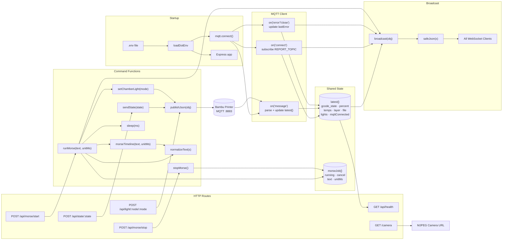
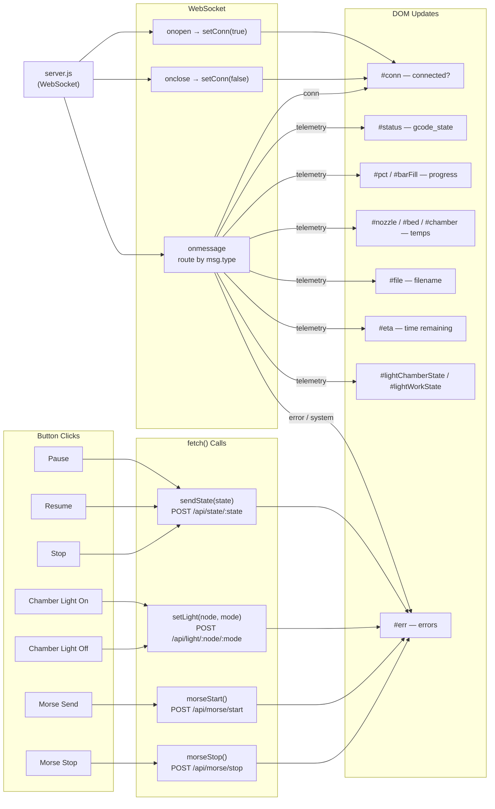
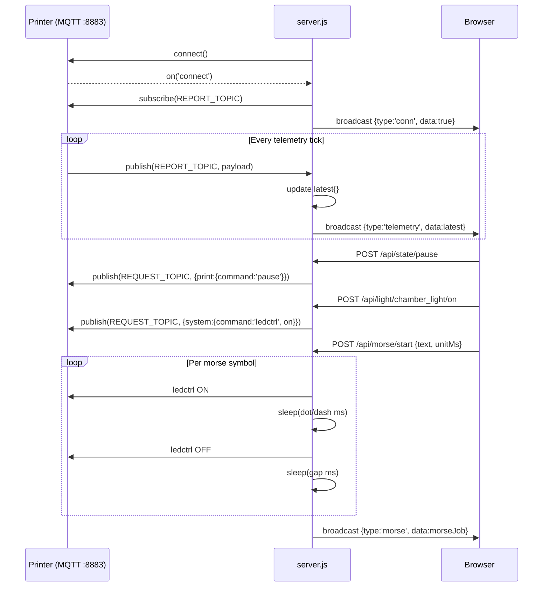
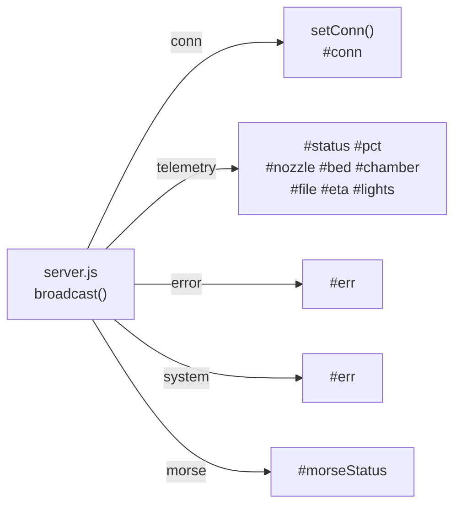
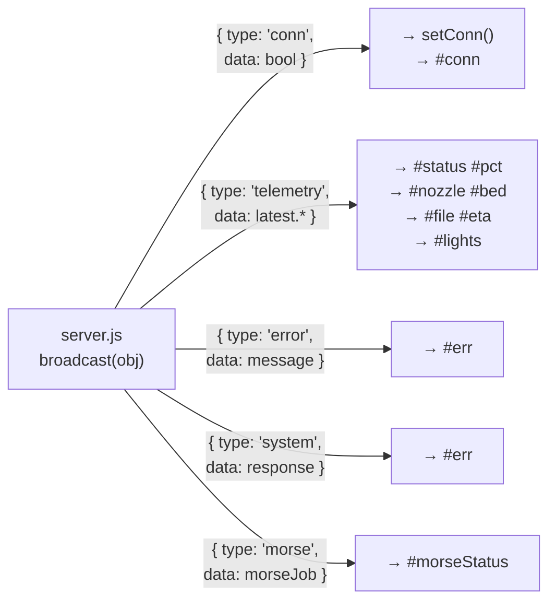
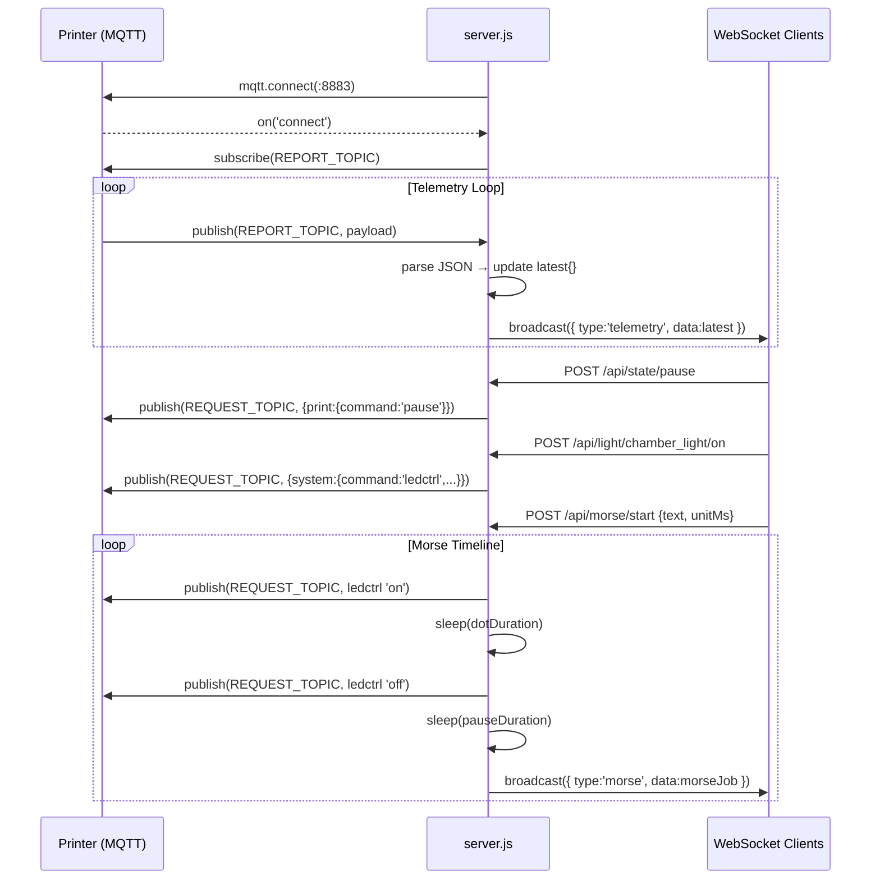

# Function Interaction Diagram

## 1. Server-Side Flow

---

## 2. Frontend Flow

---

## 3. MQTT Sequence

---

## 4. WebSocket Message Types

## Message Types (WebSocket Protocol)

## MQTT Data Flow

